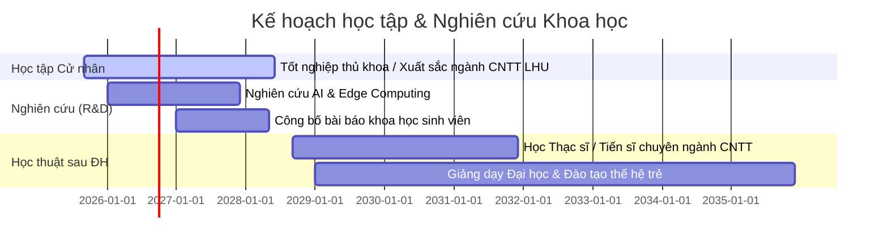

<div align="center">

# 💫 Nguyễn Hoàng Anh 💫
### 🎓 IT Undergraduate @ Lạc Hồng University | 🤖 AI & IoT Enthusiast | 👨‍🏫 Aspiring University Lecturer

<br/>


<br/>

[](https://git.io/typing-svg)

<br/>

[](https://github.com/denzxje157)
[](https://youtube.com)
[](https://lhu.edu.vn)
[](#-mục-tiêu--lộ-trình-phát-triển)

</div>

---

###  Giới thiệu chung (About Me)

```yaml
Name: Nguyễn Hoàng Anh
Current: Sinh viên Năm 2 - Khoa CNTT @ Đại học Lạc Hồng (LHU)
Passions: Deep Learning, Computer Vision, Embedded IoT, Web Architecture
Career Ambition: Trở thành Giảng viên Đại học & Nhà nghiên cứu Khoa học
Content Creation: ARTFIVE FASHION Channel
GitHub: @denzxje157
```

- 🔭 **Đang tập trung:** Nghiên cứu mô hình **Transformers** ứng dụng phân tích dữ liệu cục bộ (On-device / Edge AI) và mạng nơ-ron đa tầng.
- ⚡ **Kỹ thuật phần cứng:** Thiết kế mạch, lập trình vi điều khiển **ESP32 / ESP8266 / Arduino** kết nối cảm biến và đẩy dữ liệu đám mây.
- 🌐 **Phát triển Web & Ứng dụng:** Thiết kế UI/UX hiện đại, xây dựng kiến trúc cơ sở dữ liệu và hệ thống quản lý hoàn chỉnh.
- 🤝 **Tác phong:** Trưởng nhóm chỉn chu, có kỹ năng lập kế hoạch tiến độ, phân bổ nhiệm vụ và thuyết trình học thuật sắc bén.

---

###  Kỹ năng & Hệ sinh thái công nghệ (Tech Stack)

<div align="center">

| Lĩnh vực | Bộ công nghệ & Công cụ thực chiến |
| :--- | :--- |
| **🌐 Frontend & UI/UX** |  |
| **⚙️ Backend & Database** |  |
| **🤖 AI & Deep Learning** |  |
| **⚡ IoT & Embedded Hardware** |  `ESP32 / ESP8266` `DHT & Gas Sensors` `Relay & Motor Shields` |
| **🛠️ Tools & Environments** |  `Google Cloud / Sheets API` |

</div>

---

###  Dự án tiêu biểu (Featured Projects)

<table>
  <tr>
    <td width="50%" valign="top">
      <h3>🏛️ Sắc Việt — Heritage Marketplace</h3>
      <p>Nền tảng thương mại điện tử tôn vinh sản phẩm truyền thống, tích hợp hệ thống <b>bản đồ số tương tác</b> và <b>chatbot hỗ trợ du khách thông minh</b>.</p>
      <p>
        
        
        
        
      </p>
    </td>
    <td width="50%" valign="top">
      <h3>👁️ AI Detector — Chrome Extension</h3>
      <p>Tiện ích mở rộng sử dụng kiến trúc mô hình <b>Deep Learning Transformer</b> chạy trực tiếp trên trình duyệt (Local Runtime) để phát hiện và gắn nhãn ảnh AI chính xác cao.</p>
      <p>
        
        
        
      </p>
    </td>
  </tr>
  <tr>
    <td width="50%" valign="top">
      <h3>🚜 AgriTech — Precision Agriculture</h3>
      <p>Giải pháp bản đồ hóa nông nghiệp thông minh, tích hợp mô-đun định vị chuẩn xác và mạng nơ-ron thị giác máy tính trên thiết bị cơ giới.</p>
      <p>
        
        
        
      </p>
    </td>
    <td width="50%" valign="top">
      <h3>📊 IoT Smart Air Quality System</h3>
      <p>Hệ sinh thái quan trắc môi trường tự động sử dụng vi điều khiển ESP, cụm cảm biến khí và nhiệt độ; phân tích trạng thái và đồng bộ Google Sheets thời gian thực.</p>
      <p>
        
        
        
      </p>
    </td>
  </tr>
  <tr>
    <td width="50%" valign="top">
      <h3>📝 Cuoiki-KTLT Testing Framework</h3>
      <p>Hệ thống thi trắc nghiệm tiếng Anh với cơ sở dữ liệu quan hệ chặt chẽ, tối ưu thuật toán trộn đề thi và chấm điểm tự động.</p>
      <p>
        
        
        
      </p>
    </td>
    <td width="50%" valign="top">
      <h3>☕ LHU Smart Canteen Online</h3>
      <p>Mô hình số hóa chuỗi dịch vụ đặt món nội bộ trường học, tối ưu quy trình order và quản lý thực đơn theo thời gian thực.</p>
      <p>
        
        
        
      </p>
    </td>
  </tr>
</table>

---

###  Mục tiêu & Lộ trình phát triển (Roadmap)



- [x] 🌟 Hoàn thành xuất sắc các đồ án kỹ thuật lập trình & hệ thống.
- [ ] 🔬 Công bố công trình nghiên cứu khoa học sinh viên tại các hội nghị chuyên ngành.
- [ ] 🤖 Hoàn thiện các sản phẩm Edge AI ứng dụng thực tế.
- [ ] 🎓 Tốt nghiệp Cử nhân CNTT và theo học chương trình Sau Đại học (Master/Ph.D).
- [ ] 👨‍🏫 **Trở thành Giảng viên Đại học tận tâm, truyền lửa công nghệ cho sinh viên.**

---

###  GitHub Stats & Metrics

<div align="center">


<br/><br/>


</div>

---

<div align="center">
  
  <br/>
  <sub>Designed with ❤️ by <b>Nguyễn Hoàng Anh</b> | LHU Information Technology</sub>
</div>
